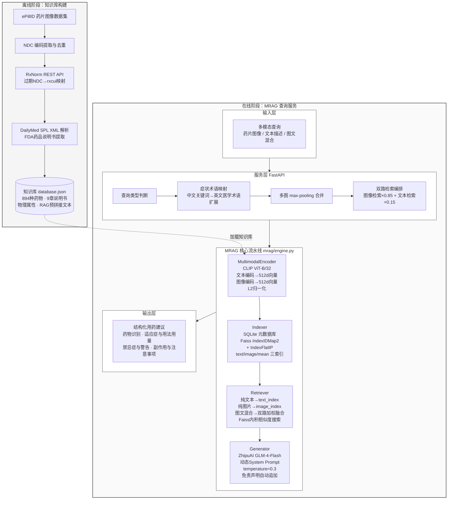

# PillMate 系统架构图

```mermaid
flowchart TB
    subgraph Offline["离线阶段：知识库构建"]
        direction TB
        A1["ePillID 药片图像数据集"]
        A2["NDC 编码提取与去重"]
        A3["RxNorm REST API<br/>过期NDC→rxcui映射"]
        A4["DailyMed SPL XML 解析<br/>FDA药品说明书提取"]
        A5[("知识库 database.json<br/>894种药物 · 9章说明书<br/>物理属性 · RAG预拼接文本")]
        A1 --> A2 --> A3 --> A4 --> A5
    end

    subgraph Online["在线阶段：MRAG 查询服务"]
        direction TB

        subgraph Input["输入层"]
            B1["多模态查询<br/>药片图像 / 文本描述 / 图文混合"]
        end

        subgraph Service["服务层 FastAPI"]
            C1["查询类型判断"]
            C2["症状术语映射<br/>中文关键词→英文医学术语扩展"]
            C3["多图 max-pooling 合并"]
            C4["双路检索编排<br/>图像检索×0.85 + 文本检索×0.15"]
            C1 --> C2 --> C3 --> C4
        end

        subgraph Pipeline["MRAG 核心流水线 mrag/engine.py"]
            direction LR
            D1["MultimodalEncoder<br/>CLIP ViT-B/32<br/>文本编码→512d向量<br/>图像编码→512d向量<br/>L2归一化"]

            D2["Indexer<br/>SQLite 元数据库<br/>Faiss IndexIDMap2<br/>+ IndexFlatIP<br/>text/image/mean 三索引"]

            D3["Retriever<br/>纯文本→text_index<br/>纯图片→image_index<br/>图文混合→双路加权融合<br/>Faiss内积相似度搜索"]

            D4["Generator<br/>ZhipuAI GLM-4-Flash<br/>动态System Prompt<br/>temperature=0.3<br/>免责声明自动追加"]

            D1 --> D2 --> D3 --> D4
        end

        subgraph Output["输出层"]
            E1["结构化用药建议<br/>药物识别 · 适应症与用法用量<br/>禁忌症与警告 · 副作用与注意事项"]
        end

        Input --> Service --> Pipeline --> Output
    end

    A5 -.->|"加载知识库"| D1

    style Offline fill:#f5f5f5,stroke:#333,stroke-width:1.5px
    style Online fill:#fafafa,stroke:#333,stroke-width:1.5px
    style Input fill:#fff,stroke:#555,stroke-width:1px
    style Service fill:#fff,stroke:#555,stroke-width:1px
    style Pipeline fill:#fff,stroke:#555,stroke-width:1px
    style Output fill:#fff,stroke:#555,stroke-width:1px
```
